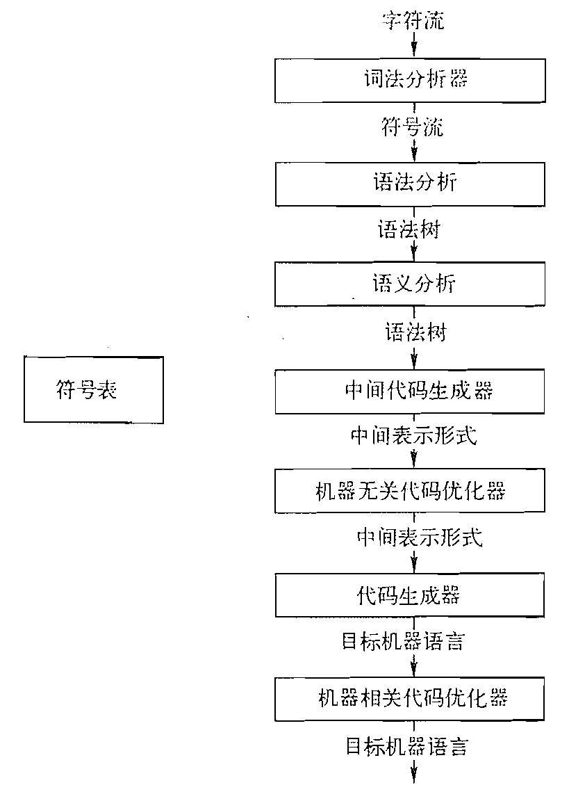
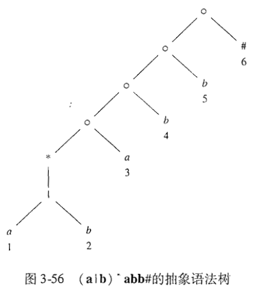
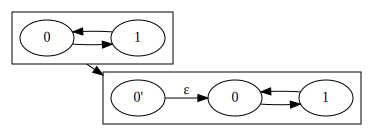
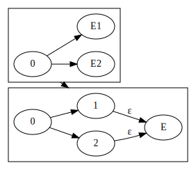
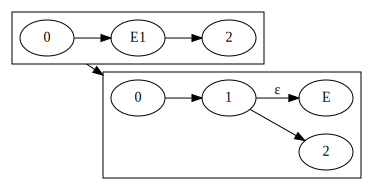
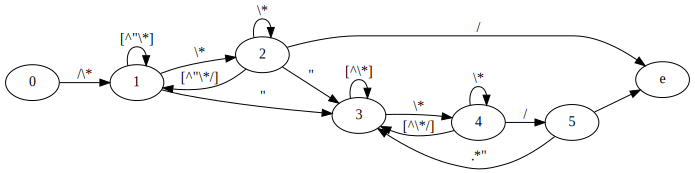
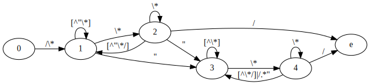
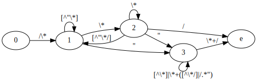
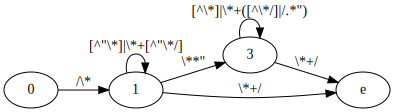

# 编译原理笔记

## 1 引论

### 1.1 语言处理器

一个编译器就是一个程序，它可以阅读以某一种语言（源语言）编写的程序，并把该程序翻译成为一个等价的、用另一种语言（目标语言）编写的程序。

解释器（interpreter）是另一种常见的语言处理器。它并不通过翻译的方式生成目标程序。从用户的角度看，解释器直接利用用户提供的输入执行源程序中指定的操作。

### 1.2 一个编译器的结构



## 3 词法分析

### 3.1 词法分析器的作用

#### 3.1.2 词法单元、模式和词素

词法单元 Token：一个表示某种词法单位的抽象符号。可能具有一个属性值，以指示是具体哪个词素匹配了这个词法单元。

模式 Pattern：描述一个词法单元的词素可能具有的形式。

词素 Lexeme：一个字符序列。可能与某个词法单元的模式匹配。

#### 3.1.3 词法单元的属性

一般来说，具体的属性值都保存在符号表中，所以词法单元的属性成员只需要一个指向符号表对应项目的指针即可。

### \*3.2 输入缓冲

双缓冲区和哨兵标记

### 3.3 词法单元的规约

#### 3.3.1 串和语言

前缀 Prefix：从串尾部删除 0 到任意多个符号得到的串。

后缀 Suffix：从串头部删除 0 到任意多个符号得到的串。

子串 Substring：从串删除某个前缀和后缀的串。

真~：既不等于 $\epsilon$，又不等于串本身的串。

子序列 Subsequence：从串中删除 0 个或任意多个符号得到的串。

连接 Concatenation：把 y 附加到 x 后的串，称 x 与 y 的连接，记作 xy。

子串必须是原字符串中连续的一段，而子序列只需前后顺序相同。例如，13 是 12345 的子序列。

#### 3.3.2 语言上的运算

将 $L^i$ 定义为将 $L$ 连接 $i$ 次后得到的所有串的集合。

Kleene 闭包：$L^*=\displaystyle\bigcup_{i=0}^\infty L^i$。

正闭包：$L^+=\displaystyle\bigcup_{i=1}^\infty L^i$。

#### 3.3.3 正则表达式

归纳基础

1. $\epsilon$ 是一个正则表达式；
2. 若 $a$ 是 $\Sigma$ 中的一个符号，则 $\bf a$ 是一个正则表达式。

归纳步骤：若 $r,s$ 是正则表达式，则下列均为正则表达式：$r|s,rs,r^*$

$r^*$ 是表示将 $r$ 重复零次或多次，对应着 Kleene 闭包。

### 3.4 词法单元的识别

#### 3.4.1 状态转换图

一个结点表示在识别过程中的一个状态，一条边表示读入的字符串。在该状态下读入该字符串，就从该结点出发，沿着该边转换到另一个结点对应的状态。

### 3.7 从正则表达式到自动机

#### 3.7.1 从 NFA 到 DFA 的转换

由 NFA 构造 DFA 的子集构造算法。

思想：NFA 状态的闭包作为 DFA 的一个状态。

$\epsilon$ 闭包：从 NFA 的某个状态 $s$ 开始只通过 $\epsilon$ 转换能到达的状态集合。

1. 初始化
   从 NFA 的开始状态开始，将开始状态的 $\epsilon$ 闭包看作 DFA 的开始状态。
2. 求 DFA 某状态的转换
   对于 DFA 上某个状态 $s$，要计算该状态的所有转换，执行如下操作。
   对于某个转换 $a$，计算 $s$ 所对应的 NFA 状态集合中的所有状态 $S$ 经转换 $a$ 所能到达的 NFA 状态集合 $\text{move}(S,a)$，再计算其 $\epsilon$ 闭包 $\epsilon\text{-closure}(\text{move}(S,a))$，该状态集对应于 DFA 的一个状态 $t$，并且 DFA 中 $s$ 从 $a$ 将转换到 $t$。
   按照上述方法计算，直到 DFA 所有状态都被计算过转换。

#### 3.7.2 NFA 的模拟

思想：只保留当前所在的 DFA 状态。

特征：边计算边使用。

1. 初始化
   计算 DFA 的开始状态，即 NFA 开始状态的 $\epsilon$ 闭包，作为当前状态 $S$。
2. 每获取到一个字符 $c$
   计算 $c$ 的转换后状态，即 $S\leftarrow\epsilon\text{-closure}(\text{move}(S,c))$。
3. 是否接受
   判断 $S\cap F$，若为 $\empty$ 则不接受，其中 $F$ 是 NFA 接受状态集。

#### 3.7.4 从正则表达式构造 NFA

McMaughton-Yamada-Thompson 算法

1. 基本规则：对于 $\epsilon$ 和单个字符，构造 NFA；
2. 归纳规则：对于并、交、Kleene 闭包，构造 NFA。

### 3.9 基于 DFA 的模式匹配器的优化

1. 由正则表达式直接生成更少状态 DFA 的算法
2. 最小化 DFA 状态数
3. 生成更加紧凑的转换表

#### 3.9.1 NFA 的重要状态

Important state：一个具有非 $\epsilon$ 离开转换的 NFA 状态。

推论：只有当 $s$ 是重要的，$\text{move}(s,a)$ 才可能是非空的。

若两个 NFA 状态集具有相同的重要状态，且要么都包含接受状态，要么都不包含，则这两个状态集是一致的。

扩展正则表达式：使用 $\#$ 表示结束符，即若原正则表达式为 $r$，则新正则表达式为 $r\#$。

抽象语法树中每一个叶子结点都可以对应 NFA 中一个重要状态。对每一个**非 $\epsilon$** 叶子结点编号，并将该编号称为该叶子节点的**位置**。



#### 3.9.2 根据抽象语法树计算得到的函数

要从一个正则表达式直接构造出 DFA，首先要构造出它的抽象语法树，然后计算如下四个函数：

1. $\text{nullable}(n)$：对于一个抽象语法树的结点 $n$，如果它代表的子表达式的语言可以生成 $\epsilon$，那么该函数则为真，否则为假；
2. $\text{firstpos}(n)$：以 $n$ 为根的子表达式的语言能生成一系列字符串，这些字符串第一个字符对应的叶子节点的位置属于该集合；
3. $\text{lastpos}(n)$：以 $n$ 为根的子表达式的语言能生成一系列字符串，这些字符串最后一个字符对应的叶子节点的位置属于该集合；
4. $\text{followpos}(p)$：对于位置 $p$，如果在一个合法的字符串中，位置 $q$ 所对应的字符紧跟着位置 $p$ 所对应的字符，那么 $q$ 就属于该集合。

#### 3.9.3 计算 $\text{nullable}$、$\text{firstpos}$ 及 $\text{lastpos}$

1. 对于标号为 $\epsilon$ 的叶子结点 $n$，显然 $\text{nullable}(n)$ 为真。由于它只能生成空串，因此都不存在所谓的第一个字符和最后一个字符，也即 $\text{firstpos}(n)=\text{lastpos}(n)=\empty$。
2. 对于位置为 $i$ 的叶子结点 $n$，显然 $\text{nullable}(n)$ 为假。由于它只能生成一个字符，因此 $\text{firstpos}(n)=\text{lastpos}(n)=\{i\}$。
3. 对于一个 or 结点 $n=c_1|c_2$，若 $c_1$ 或 $c_2$ 能生成空串，则 $n$ 就能生成空串，因此 $\text{nullable}(n)=\text{nullable}(c_1) \vee \text{nullable}(c_2)$。$n$ 只能在 $c_1$，$c_2$ 中选择一个，因此其生成的串的第一个和最后一个符号都等于选择的那个，即 $\text{firstpos}(n)=\text{firstpos}(c_1) \cup \text{firstpos}(c_2)$，$\text{lastpos}(n)=\text{lastpos}(c_1) \cup \text{lastpos}(c_2)$。
4. 对于一个 cat 结点 $n=c_1c_2$，只有 $c_1$，$c_2$ 均能生成空串，那么 $n$ 才能生成空串，因此 $\text{nullable}(n)=\text{nullable}(c_1) \wedge \text{nullable}(c_2)$。若 $c_1$ 能生成空串，那么 $n$ 才有可能以 $c_2$ 为开头生成串，因此

   $$
   \text{firstpos}(n)=\text{firstpos}(c_1) \cup \begin{cases}
      \text{firstpos}(c_2) & \text{nullable}(c_1) \\
      \empty & \text{otherwise}
   \end{cases}
   $$

   同理，若 $c_2$ 能生成空串，那么 $n$ 才有可能以 $c_1$ 为结尾生成串，因此

   $$
   \text{lastpos}(n)=\text{lastpos}(c_2) \cup \begin{cases}
      \text{lastpos}(c_1) & \text{nullable}(c_2) \\
      \empty & \text{otherwise}
   \end{cases}
   $$

5. 对于一个 star 结点 $n=c_1^*$，显然 $\text{nullable}(n)$ 为真。$n$ 生成的所有非空串均以 $c_1$ 作为开头和结尾，因此 $\text{firstpos}(n)=\text{firstpos}(c_1)$，$\text{lastpos}(n)=\text{lastpos}(c_1)$。

#### 3.9.4 计算 $\text{followpos}$

只有两种情况会使得一个位置紧跟在另一个位置之后。

1. 连接运算。如果 $n=c_1c_2$，那么 $c_2$ 首字符对应位置都可能紧跟在 $c_1$ 尾字符对应位置之后，即 $\forall_{i\in\text{lastpos}(c_1)}\text{firstpos}(c_2)\subseteq\text{followpos}(i)$。
2. 连接运算的特殊情况，星号运算。此时 $n$ 的首字符对应位置都可能紧跟在 $n$ 的尾字符对应位置之后，即 $\forall_{i\in\text{lastpos}(n)}\text{firstpos}(n)\subseteq\text{followpos}(i)$。这只不过是第一种情况下 $c_1=c_2=n$。

#### 3.9.5 根据正则表达式构建 DFA

一个 DFA 状态就是一个叶子结点位置集合。

1. 根据扩展正则表达式构建抽象语法树并计算上述四个函数。
2. 初始化 DFA $D$ 使其包含未标记的状态 $\text{firstpos}(n_0)$，其中 $n_0$ 是抽象语法树的根节点。
3. 若 $D$ 中包含未标记的状态 $S$，将其标记，然后对于每个输入符号 $a$，计算 $U=\displaystyle\bigcup_p \text{followpos}(p)$，其中位置 $p\in S$ 的标号为 $a$，将未标记状态 $U$ 不重复地加入到 $D$ 中，添加一条从 $S$ 到 $U$ 标号为 $a$ 的边。重复直到所有状态均被标记为止。

#### 3.9.6 最小化一个 DFA 的状态数

设存在状态 $s,t$ 和状态集 $A$。若存在一个串 $x$，使得 $s$ 沿着 $x$ 能到达一个状态 $u\in A$，而 $t$ 却不能沿着 $x$ 到达 $A$ 中的任何一个状态，则称 $x$ 区分 $s,t$，又称 $s,t$ 是可区分的。

首先将 DFA 划分为两个状态集：非接受状态集和接受状态集。若状态集 $A$ 中有可区分的状态，将该状态集划分为两个更小的状态集 $A_1,A_2$，其中 $A_1$ 中的状态只能到达 $A$ 中的状态，而 $A_2$ 则不是。一直划分直到所有状态集均不能被划分，然后将每个状态集合并为一个状态。

### 3.A DFA 生成正则表达式

> <https://blog.csdn.net/qq_42549774/article/details/103456107>

由 DFA 生成正则表达式有两种方法：

1. Arden 法
2. 状态消除法

#### 3.A.1 Arden 定理

设有正则表达式 $P,Q,R$，若 $P$ 不接受空串，则方程 $R=Q|RP$ 有唯一解 $R=QP*$。注意若 $P$ 接受空串，则方程恒成立。

证明：我们可以将正则表达式看作一个文法，然后使用立即左递归消除算法可得到

$$
\begin{aligned}
   R&=QR' \\
   R'&=PR'|\epsilon
\end{aligned}
$$

显然 $R'=P*$，因此 $R=QP*$。

DFA 要求只能有一个起始状态。

对于 DFA 的每一个状态 $S$，列出方程 $S=\displaystyle\sum_i \alpha_i S_i$，其中 状态 $S_i$ 有一条指向 $S$，标记为 $\alpha_i$ 的边。如果 $S$ 是初始状态，那么方程式还要加上 $\epsilon$。列出所有方程式后，解出接受状态即为所求正则表达式。

#### 3.A.2 状态消除法

第一步，初步处理 DFA。

1. 如果 DFA 的初始状态有入边，将其按照下图方法消除。
   
2. 按照下图方法合并所有接受状态。
   
3. 按照下图方法消除接受状态的出边。
   

第二步，消除状态。选择一个状态 $S$ 消除。对于所有指向 $S$ 的状态 $I$，对于所有 $S$ 指向的状态 $O$，设 $a$，$b$ 分别是 $I$ 指向 $S$，$S$ 指向 $O$ 边的标记。

1. 如果 $S$ 没有指向自身的边，添加一条从 $I$ 指向 $O$ 的边，其标记为 $ab$。
2. 如果 $S$ 有指向自身的边，标记为 $c$，则对于所有这样的边，都要添加一条从 $I$ 指向 $O$ 的边，其标记为 $ac*b$。

---

例题：写出匹配注释，即 `/*` 和 `*/` 之间的串，且串中没有不在双引号（`"`）中的 `*/`，的正则表达式。

注意正则表达式不能匹配任意深度的嵌套结构，因此我们认为只要一个 `*/` 在两个双引号之间即可。

解题：画出识别该串的 DFA 如下



解法一：Arden 法，列出方程组如下。

$$
\left\{\begin{aligned}
   q_0&=\epsilon \\
   q_1&=q_0\texttt{/\textbackslash*}+q_2\texttt{[\char`\^"\textbackslash*/]}+q_1\texttt{[\char`\^"\textbackslash*]} \\
   q_2&=q_1\texttt{\textbackslash*}+q_2\texttt{\textbackslash*} \\
   q_3&=q_1\texttt{"}+q_2\texttt{"}+q_4\texttt{[\char`\^\textbackslash*/]}+q_5\texttt{.*"}+q_3\texttt{[\char`\^\textbackslash*]} \\
   q_4&=q_3\texttt{\textbackslash*}+q_4\texttt{\textbackslash*} \\
   q_5&=q_4\texttt{/} \\
   q_e&=q_2\texttt{/}+q_5
\end{aligned}\right.
$$

将 $q_0$ 代入 $q_1$，$q_5$ 代入 $q_3,q_e$，然后利用 Arden 定理求 $q_2,q_4$ 得

$$
\left\{\begin{aligned}
   q_1&=\texttt{/\textbackslash*}+q_2\texttt{[\char`\^"\textbackslash*/]}+q_1\texttt{[\char`\^"\textbackslash*]} \\
   q_2&=q_1\texttt{\textbackslash*+} \\
   q_3&=q_1\texttt{"}+q_2\texttt{"}+q_4\texttt{([\char`\^\textbackslash*/]|/.*")}+q_3\texttt{[\char`\^\textbackslash*]} \\
   q_4&=q_3\texttt{\textbackslash*+} \\
   q_e&=(q_2+q_4)\texttt{/}
\end{aligned}\right.
$$

将 $q_2$ 代入 $q_1,q_3,q_e$，$q_4$ 代入 $q_3,q_e$，对 $q_1,q_3$ 使用 Arden 定理得

$$
\left\{\begin{aligned}
   q_1&=\texttt{/\textbackslash*((\textbackslash*+[\char`\^"\textbackslash*/])|[\char`\^"\textbackslash*])*} \\
   q_3&=q_1\texttt{\textbackslash**"(\textbackslash*+([\char`\^\textbackslash*/]|/.*")|[\char`\^\textbackslash*])*} \\
   q_e&=(q_1+q_3)\texttt{\textbackslash*+/}
\end{aligned}\right.
$$

将 $q_1,q_3$ 代入 $q_e$ 得

$$
q_e=\texttt{/\textbackslash*((\textbackslash*+[\char`\^"\textbackslash*/])|[\char`\^"\textbackslash*])*(\textbackslash**"(\textbackslash*+([\char`\^\textbackslash*/]|/.*")|[\char`\^\textbackslash*])*)?\textbackslash*+/}
$$

解法二：状态消除法，优先将入度小的状态消除，因此首先消除状态 5，得到如下图



再消除状态 4，得到如下图



再消除状态 2，得到如下图



再消除状态 3 和 1 即可得到正则表达式 `/\*([^"\*]|\*+[^"\*/])*(\**"([^\*]|\*+([^\*/]|/.*"))*)?\*+/`。

## 4 语法分析

### 4.2 上下文无关文法

终结符号：组成串的基本符号。一般是词法单元。

非终结符号：表示串集合的语法变量。

开始符号：某个非终结符号，该符号表示的串集合就是该文法所能生成的语言。

产生式：描述将终结符号和非终结符号组合成串的方法。

#### 4.2.3 推导

若通过一个产生式能将一个串 $\alpha$ 替换为另外一个串 $\beta$，则将该过程写作 $\alpha\Rightarrow\beta$。

若 $\alpha$ 经 0 步或以上推导得到 $\beta$，则 $\alpha\stackrel{*}{\Rightarrow}\beta$。

若 $S\stackrel{*}{\Rightarrow}\alpha$，其中 $S$ 是文法 $G$ 的开始符号，则 $\alpha$ 是 $G$ 的一个句型（Sentential form）。不包含非终结符号的句型称为句子（Sentence）。

若总是选择句型的最左边的非终结符号进行替换，则称为最左推导（Leftmost derivation），同理有最右推导。

#### 4.2.4 语法分析树和推导

根节点代表该串的非终结符号，子节点代表该非终结符号的对应串。从左至右排列语法分析树的符号就能得到一个句型，称之为这棵树的结果（yield）或边缘（frontier）。

#### 4.2.5 二义性 Ambiguous

指一个文法能够为某个句子生成多个语法分析树。

### 4.3 设计文法

#### 4.3.1 左递归的消除

##### 4.3.1.1 消除立即左递归

$$
A\rightarrow A\alpha_1|A\alpha_2|\cdots|A\alpha_m|\beta_1|\beta_2|\cdots|\beta_n
$$

其中 $\beta_i$ 不以 $A$ 开头。将其替换为

$$
\begin{aligned}
   A&\rightarrow \beta_1A'|\beta_2A'|\cdots|\beta_nA' \\
   A'&\rightarrow\alpha_1A'|\alpha_2A'|\cdots|\alpha_mA'|\epsilon
\end{aligned}
$$

即将所有形如 $A\rightarrow A\alpha_i$ 的产生式替换为 $A'\rightarrow\alpha_i A'$，将所有形如 $A\rightarrow\beta_i$ 的产生式替换为 $A\rightarrow\beta_i A'$，最后添加一条产生式：$A'\rightarrow\epsilon$。

证明上述两个文法是相等的，我们再将文法修改成下面的形式：

$$
\begin{aligned}
   A&\rightarrow \beta A' \\
   \beta &\rightarrow \beta_1|\beta_2|\cdots|\beta_n \\
   A'&\rightarrow \alpha_1A'|\alpha_2A'|\cdots|\alpha_mA'|\epsilon
\end{aligned}
$$

显然第二个文法和第三个文法是相等的，所以我们只需要证明第三个文法和第一个文法相等即可。开始时，文法三首先使用产生式一推导得到 $A\Rightarrow\beta A'$。文法一只能使用两种产生式，对此进行分类讨论。

1. 如果文法一使用一个形如 $A\rightarrow A\alpha_i$ 的产生式，那么文法三就使用产生式 $A'\rightarrow\alpha_i A'$，从而文法一有 $A\stackrel{+}{\Rightarrow} A\alpha_i$，而文法三有 $A\stackrel{+}{\Rightarrow}\beta\alpha_i A'$。显然，按照这条规则，无论文法一推导多少步，生成的句型与文法三生成的句型都有相同的 $\alpha_i$ 串，其中 $\alpha_i$ 串是指形如 $\alpha_a\alpha_b\alpha_c\cdots$ 的只由 $\alpha_i$ 生成的串。
2. 我们再利用一个明显的事实，即无论文法一推导多少步，其生成的句型中最多只有一个 $A$。我们忽略 $\alpha_i,\beta_i$ 生成 $A$ 的情况，因为只希望证明两个文法能生成相同的只带有 $\alpha_i,\beta_i$ 的句型，因此我们不使用任何左部为 $\alpha_i$ 或 $\beta_i$ 的产生式。这样一来，一旦文法一使用一个形如 $A\rightarrow\beta_i$ 的产生式，那么就会得到句型 $\beta_i\alpha_i$，$A$ 的左递归就结束了。此时文法三使用产生式 $\beta\rightarrow\beta_i$ 和 $A'\rightarrow\epsilon$ 就得到相同的句型 $\beta_i\alpha_i$。

##### 4.3.1.2 消除无环或 $\epsilon$ 产生式文法的左递归

环：$A\stackrel{+}{\Rightarrow}A$；$\epsilon$ 产生式：$A\rightarrow\epsilon$。

上述的立即左递归消除算法不能消除两步或多步产生的左递归，例如如下文法，我们可以有这样的推导：$S\Rightarrow Aa\Rightarrow Sda$，这样立即左递归消除算法就不能消除 $S$ 的左递归。但是我们可以先将 $A$ 的立即左递归消除，然后将 $A$ 代入到 $S$ 中，就能对 $S$ 消除立即左递归了。

$$
\boxed{\begin{aligned}
   S&\rightarrow Aa|b \\
   A&\rightarrow Ac|Sd|\epsilon
\end{aligned}}
\Rightarrow
\boxed{\begin{aligned}
   S&\rightarrow Aa|b \\
   A&\rightarrow SdA'|A' \\
   A'&\rightarrow cA'|\epsilon
\end{aligned}}
\Rightarrow
\boxed{\begin{aligned}
   S&\rightarrow SdA'a|A'a|b \\
   A'&\rightarrow cA'|\epsilon
\end{aligned}}
\Rightarrow
\boxed{\begin{aligned}
   S&\rightarrow A'aS'|bS' \\
   S'&\rightarrow dA'aS'|\epsilon \\
   A'&\rightarrow cA'|\epsilon
\end{aligned}}
$$

假定文法 $G$ 没有环或 $\epsilon$ 产生式，对每个文法符号 $A_i$，执行下列算法：

1. 对于所有 $j\in[1,i-1]$，将 $A_i\rightarrow A_j\gamma$ 替换为 $A_i\rightarrow \delta_1\gamma|\delta_2\gamma|\cdots|\delta_k\gamma$，其中 $A_j\rightarrow\delta_1|\delta_2|\cdots|\delta_k$。
   这一步是消除所有能降低非终结符号 $A_i$ 编号值的产生式。由于我们对每个非终结符号都进行了编号，因此若文法中存在两步或多步左递归，就一定存在这样的一条推导路径，其中一部分推导提高非终结符号的编号值，另一部分推导降低或不改变非终结符号的编号值，而后一部分的推导正是导致左递归的原因。我们希望文法中只有前一部分的推导，因此这一步先消除能降低非终结符号 $A_i$ 编号值的产生式，对于不改变非终结符号编号值的产生式，就是立即左递归，留给下一步消除即可。
2. 消除替换后的立即左递归。

### 4.4 自顶向下语法分析

1. 递归下降语法分析（无法分析左递归语法）
2. 预测分析
   对于某些文法，可以构造出向前看 $k$ 个符号的预测分析器，称为 $\text{LL}(k)$ 文法类。

#### 4.4.2 FIRST 和 FOLLOW

$\text{FIRST}(\alpha)$：可从 $\alpha$ 推导得到的串的首符号集合。

1. 若 $X$ 为终结符号，则 $\text{FIRST}(X)=X$
2. 若 $X\rightarrow Y_1Y_2\cdots Y_k$，将 $\text{FIRST}(Y_1)$ 加入到 $\text{FIRST}(X)$ 中。
   1. 若对 $j\in[1,i-1]$，$\text{FIRST}(Y_j)$ 中都有 $\epsilon$，说明有 $X\Rightarrow Y_iY_{i+1}\cdots Y_k$，因此将 $\text{FIRST}(Y_i)$ 加入到 $\text{FIRST}(X)$ 中。
   2. 若上述条件对 $j\in[1,k]$ 都成立，说明有 $X\Rightarrow\epsilon$，因此将 $\epsilon$ 加入到 $\text{FIRST}(X)$ 中。

$\text{FOLLOW}(A)$：可能在某些句型中**紧跟**非终结符号 $A$ 中的终结符号集合。也就是说，在匹配了 $A$ 之后，接下来可能匹配的终结符号就是 $\text{FOLLOW}(A)$。要注意不能从 $A$ 所推导的串中寻找 $\text{FOLLOW}(A)$。

> 若 $A$ 是非终结符号，$b$ 是终结符号，则 $Ab$ 称作【$b$ 紧跟 $A$】或【$A$ 后面紧跟 $b$】。

1. 输入右端的终结标记 $\$$ 一定在 $\text{FOLLOW}(S)$ 中，其中 $S$ 是开始符号。
2. 若 $A\rightarrow\alpha B\beta$，则 $\text{FIRST}(\beta)-\epsilon\subseteq\text{FOLLOW}(B)$。注意到 $B$ 后面接着的是 $\beta$，这意味着 $\beta$ 的句型的首符号都可能在某些句型中紧跟$B$。
3. 若 $A\rightarrow\alpha B$，则 $\text{FOLLOW}(A)\subseteq\text{FOLLOW}(B)$。这是说，若 $A$ 后面紧跟着一个终结符号，将 $A$ 替换为 $\alpha B$ 后，$B$ 后面也紧跟着这个终结符号。

#### 4.4.3 LL(1) 文法

两个 L 分别代表“从左向右扫描输入”、“产生最左推导”，1 表示在每一步中只需要向前看 1 个符号来确定语法分析动作。

若文法 $G$ 的任一产生式 $A\rightarrow\alpha|\beta$ 满足：

1. 不存在终结符号 $a$ 使得 $\alpha,\beta$ 都能推导出以 $a$ 开头的串，且 $\alpha,\beta$ 最多只有一个可以推导出空串，即 $\text{FIRST}(\alpha)\cap\text{FIRST}(\beta)=\empty$，否则就不能只看 1 步决定选择 $\alpha$ 还是 $\beta$
2. 如果 $\beta\stackrel{*}{\Rightarrow}\epsilon$，那么 $\alpha$ 不能推导出任何以 $\text{FOLLOW}(A)$ 中某个终结符号（除了终结标记 $\$$）作为开头的串。该条件中 $\alpha,\beta$ 的位置可以互换。即若 $\epsilon\in\text{FIRST}(\beta)$，则 $\text{FIRST}(\alpha)\cap\text{FOLLOW}(A)=\empty$。如果违反此规则，则当遇到 $\text{FOLLOW}(A)$ 中某个终止符号时，就不能知道究竟是留给 $\alpha$ 匹配还是 $A$ 后面的文法符号匹配。
   如下文法

   $$
   A\rightarrow(B)\\
   B\rightarrow)|\epsilon
   $$

   当匹配 $())$ 的第一个右括号时，由于只能向前看 1 个符号，只知道第一个右括号存在，应该为 $B$ 匹配 $)$ 还是 $\epsilon$ 呢？这个例子应该为 $B$ 匹配 $)$，但在匹配 $()$ 时应该为 $B$ 匹配 $\epsilon$，然而在 LL(1) 中两者在匹配第一个右括号时所得信息一致，无法区分。

   如下文法

   $$
   A\rightarrow(B)\\
   B\rightarrow a|\epsilon
   $$

   当匹配 $()$ 时，扫描右括号，对于 $B$ 来说应该匹配 $\epsilon$，而匹配 $(a)$ 扫描 $a$ 时，对于 $B$ 来说直接匹配 $a$ 即可。

预测分析表 $M[A,a]$，其中 $A$ 是一个非终结符号，而 $a$ 是一个终结符号或 $\$$。表中的条目是产生式。该表的使用方法：在匹配 $A$ 时，若遇到输入符号 $a$，对其应用产生式 $M[A,a]$。

生成方法：对于文法 $G$ 的每个产生式 $A\rightarrow\alpha$

1. $\forall a\in\text{FIRST}(\alpha)$，将 $A\rightarrow\alpha$ 加入到 $M[A,a]$ 中。这意味着在匹配 $A$ 时，如果遇到了 $\alpha$ 的首符号 $a$，就应用 $A\rightarrow\alpha$。
2. 若 $\epsilon\in\text{FIRST}(\alpha)$，则 $\forall b\in\text{FOLLOW}(A)$，将 $A\rightarrow\alpha$ 加入到 $M[A,b]$ 中。这里 $b$ 有可能是终结符号或 $\$$。这意味着在匹配 $A$ 时，若 $\alpha$ 能匹配空串，由于空串是主动识别而不能通过读入字符直接判断，因此如果遇到了 $\text{FOLLOW}(A)$ 中的某个字符，也对其应用产生式 $A\rightarrow\alpha$，使 $A$ 能正确匹配 $\epsilon$。注意到在匹配了 $A$ 之后，应该马上匹配 $\text{FOLLOW}(A)$ 中的某一个字符。

#### 4.4.4 非递归的预测分析

一个预测分析器的实现。

```python
w = 读入符号()
while 栈不空:
   X = 栈顶产生式
   弹出栈顶符号
   if X == w:
      w = 读入符号()
   elif X 是终结符号 or M[X,w] 是空条目:
      错误
   else:
      将 Yk,...,Y1 压入栈中，其中 M[X,w] = X -> Y1Y2...Yk
```

#### \*4.4.5 预测分析中的错误恢复

##### 4.4.5.1 恐慌模式

```python
w = 读入符号()
while 栈不空:
X = 栈顶符号
弹出栈顶符号
while True:
   error = False
   if X == w:
      w = 读入符号()
   elif X 是终结符号:
      错误
   elif M[X,w] 是空条目:
      error = True
      w = 读入符号()
   elif M[X,w] 是同步条目:
      pass
   else:
      将 Yk,...,Y1 压入栈中，其中 M[X,w] = X -> Y1Y2...Yk
   if not error:
      break
```

思想：若预测分析表读取到空条目，就忽略该输入符号；若读取到同步条目，就忽略该非终结符号

生成非终结符号的同步集合的一些启发式规则：

1. 将 $\text{FOLLOW}(A)$ 中所有符号放入 $A$ 的同步集合中。这是说，若在匹配 $A$ 的过程中遇到了紧接 $A$ 的终结符号，那么忽略$A$有可能是正确的
2. 高层结构内部包含底层结构，在匹配底层结构时，若遇到了疑似高层结构的开头，则可以忽略该底层结构。因此将高层结构的开始符号加入到底层结构的同步集合中

### 4.5 自底向上的语法分析

#### 4.5.1 归约

将串替换为与其匹配的非终结符号，即推导的反过程，因此从左到右的规约对应着最右推导。

#### 4.5.2 句柄剪枝

若有 $S\stackrel{*}{\underset{rm}{\Rightarrow}}\alpha Aw\underset{rm}{\Rightarrow}\alpha\beta w$，则 $A\rightarrow\beta$ 是 $\alpha\beta w$ 的一个句柄。对于一个自底向上语法分析过程来说，关键就是从 $w$ 中正确分离出 $\alpha,\beta,w$，从而使用 $\beta$ 的句柄进行规约。

#### 4.5.3 移入-规约语法分析技术

将输入字符串从左到右移入到栈中，并从栈顶取合适的串进行规约。

#### 4.5.4 移入-规约语法分析中的冲突

移入/规约冲突：即使知道栈中的所有内容以及接下来的 $k$ 个输入符号，仍无法判断应执行移入还是规约操作。

规约/规约冲突：无法在多个可能的规约方法中选择正确的规约动作。

### 4.6 简单 LR 技术

$\text{LR}(k)$ 文法：$L$ 表示从左到右扫描，$R$ 表示反向构造最右推导，$k$ 表示向前看 $k$ 个符号。

#### 4.6.2 项和 LR(0) 自动机

一个文法 $G$ 的一个 $\text{LR}(0)$ 项是 $G$ 的一个产生式再加上一个位于它的体中某处的点。这个点指明当前语法分析状态位于该产生式的哪个位置。

##### 4.6.2.1 增广文法

设文法 $G$ 的开始符号是 $S$，则 $G$ 的增广文法 $G'$ 是在 $G$ 中加上新开始符号 $S'$ 和产生式 $S'\rightarrow S$ 所得到的文法。当且仅当产生式 $S'\rightarrow S$ 被使用时，表示文法 $G$ 已得到匹配。

##### 4.6.2.2 项集的闭包

设 $I$ 是 $G$ 的项集，则 $\text{CLOSURE}(I)$ 的构造法是：

1. 将 $I$ 中的所有项加入到 $\text{CLOSURE}(I)$ 中
2. 若 $A\rightarrow \alpha\cdot B\beta$ 在 $\text{CLOSURE}(I)$ 中，$B\rightarrow\gamma$ 是一个产生式，并且 $B\rightarrow \cdot\gamma$ 不在 $\text{CLOSURE}(I)$ 中，就将这个项加入其中。不断使用这个规则，直到没有新项可以加入到 $\text{CLOSURE}(I)$ 中。

假设当前语法分析处于项 $A\rightarrow \alpha\cdot B\beta$，这表示接下来应该匹配 $B$。一旦匹配 $B$，即进入项 $B\rightarrow \cdot\gamma$。因此，若当前语法分析所在项属于项集 $I$，则 $\text{CLOSURE}(I)$ 表示当前状态经上述的等价产生式替换后产生的可能项的集合。因此，$\text{CLOSURE}(I)$ 输出的是一个项集。

要注意在 $\text{CLOSURE}(I)$ 中的项可以无条件任意到达，即在这些项当中转换并不能推进语法分析过程，也即这些项所构成的集合只代表一个状态。

内核项：$S'\rightarrow\cdot S$ 和所有点不在最左端的项
非内核项：除了 $S'\rightarrow\cdot S$ 的所有点在最左端的项

在一个项集闭包中的所有项即为该项集闭包中内核项子集的闭包。因此，只使用内核项就能表示该项集闭包。

> 所有点在最左端的项都可以根据闭包构造算法加入到闭包中，因此这些项被称为非内核项，不需要主动记忆，只需要在使用到时计算即可，除了增广文法的起始项 $S'\rightarrow\cdot S$，因为没有产生式体包含 $S'$。
> 想要在内核项之间发生转换，必然需要匹配某个文法符号。

##### 4.6.2.3 `GOTO`函数

$$
\text{GOTO}(I,X)=\bigcup_{A\rightarrow\alpha\cdot X\beta\in I}\text{CLOSURE}(\{A\rightarrow\alpha X\cdot\beta\})
$$

该集合表示在项 $A\rightarrow\alpha\cdot X\beta$ 所表示的状态中，经过输入 $X$ 后所能到达的状态所对应的项集的并集。因此，该函数输出的是项集。

> 根据该函数的计算方法可知，想要到达状态 $\text{GOTO}(I,X)$，必定是经过文法符号 $X$。

##### 4.6.2.4 规范 $\text{LR}(0)$ 项集族构造算法

规范 $\text{LR}(0)$ 项集族是这样的一族项集，它们能用于表示一个 $\text{LR}(0)$ 自动机的状态，而这个自动机能用于识别 LR 文法 $G$。

1. 将项集族 $C$ 初始化为 $\{\text{CLOSURE}(\{S'\rightarrow\cdot S\})\}$
2. 对于 $C$ 中的每个项集 $I$，对于每个文法符号 $X$，若 $\text{GOTO}(I,X)\notin C$，则将它加入到 $C$ 中，否则停止，得到规范 $\text{LR}(0)$ 项集族 $C$。

##### 4.6.2.5 $\text{LR}(0)$ 自动机及其用法

该自动机的状态集即为规范 $\text{LR}(0)$ 项集族。注意一个状态对应一个项集，因此状态集对应项集族。状态机的转换由 $\text{GOTO}$ 函数给出，即状态 $I$ 有一条出边 $X$ 指向状态 $\text{GOTO}(I,X)$。开始状态是 $\text{CLOSURE}(\{S'\rightarrow\cdot S\})$。

#### 4.6.3-4.6.4 LR 语法分析算法：SLR

$\text{ACTION}$ 函数有两个参数，一个是状态 $i$，另一个是终结符号 $a$，取值有下列 4 种形式：

1. 移入状态 $j$。这表示在状态 $i$ 遇到输入符号 $a$ 时，应该将 $a$ 移入从而让它等待被规约，同时移入的状态 $j$ 表示当前正在准备规约带 $a$ 的字符串。注意在实践中 $a$ 将被丢弃，因为它不再需要被用到。
2. 规约 $A\rightarrow\beta$。这表示现在已经读入足够的符号来进行规约，那么就立即进行规约。
3. 接受。
4. 报错。

在初始化阶段，栈顶状态 $s$ 为初始状态，符号 $a$ 为输入符号的第一个符号。

在循环阶段，根据 $\text{ACTION}(s,a)$ 的取值进行下一步操作。

1. 移入状态 $t$：将 $t$ 压入栈中，令 $a$ 为下一个输入符号
2. 规约 $A\rightarrow\beta$：从栈中弹出 $|\beta|$ 个状态，压入 $\text{GOTO}(t,A)$，其中 $t$ 是压入前的栈顶符号。

> 为什么规约时还要压入状态？
> 假设有产生式
>
> $$
> \begin{aligned}
>    S&\rightarrow A \\
>    A&\rightarrow\beta
> \end{aligned}
> $$
>
> 当规约 $A\rightarrow\beta$ 后，返回到上一个产生式 $S\rightarrow A$，此时相当于移入 $A$，因此还要读入下一个状态。对于上面的例子来说，上一层产生式 $S\rightarrow A$ 仍需要规约，那么 $\text{GOTO}(S,A)$ 就是项 $S\rightarrow A\cdot$ 所在状态。在该状态下一旦读入一个符号就会进行规约。

构造 SLR 语法分析表的算法：

1. 构造 $G'$ 的规范 LR(0)项集族 $C=\{I_0,I_1,\cdots,I_n\}$
2. 对每个 $I_i,i=0,1,\cdots,n$，构造状态 $i$ 和语法分析动作，如下所示
   1. 若 $A\rightarrow\alpha\cdot a\beta\in I_i\wedge\text{GOTO}(I_i,a)=I_j$，则 $\text{ACTION}(i,a)=\textit{shift}\ j$
   2. 若 $A\rightarrow\alpha\cdot\in I_i$，则 $\forall_{a\in\text{FOLLOW}(A)}\text{ACTION}(i,a)=\textit{reduce}\ A\rightarrow\alpha$，这里 $A\neq S'$
   3. 若 $S'\rightarrow S\cdot\in I_i$，则 $\text{ACTION}(i,\$)=\textit{accept}$

#### 4.6.5 可行前缀

可以出现在一个移入-规约语法分析器的栈中的最右句型前缀被称为可行前缀。

### \*4.7 更强大的 LR 语法分析器

#### 4.7.1 规范 $\text{LR}(1)$ 项

考虑下列文法

$$
S\rightarrow \text{id} | S+ | S+S
$$

当匹配 $\text{id+id}$ 和 $\text{id++id}$ 时，都会读入 $\text{id+}$。此时，应该将其规约为 $S$ 还是继续移入呢？对于 $\text{id+id}$，应该继续移入，而对于 $\text{id++id}$ 则应该规约。像这种移入-规约冲突，能够通过向前看一个字符来解决：若选择规约 $S$，则接下来的输入符号应该是 $\text{FOLLOW}(S)$（在这个例子中是 $\{+\}$）。因此，对于 $\text{id+id}$，移入 $\text{id+}$ 后的符号是 $\text{id}$，则不应对其规约，而选择移入操作。

对一个如 $S\rightarrow S+\cdot$ 的 $\text{LR}(0)$ 项，添加一个向前看符号，如 $+$，即成为 $\text{LR}(1)$ 项 $[S\rightarrow S+\cdot,+]$，意味着当来到该项的状态时，只有下一符号为向前看符号时才进行规约，否则进行移入。对于形如 $[A\rightarrow\alpha\cdot\beta,a]$ 且 $\beta\neq\epsilon$ 的 $\text{LR}(1)$ 项来说，向前看符号没有任何作用。

若存在一个推导 $S\stackrel{*}{\underset{rm}{\Rightarrow}}\delta Aw\underset{rm}{\Rightarrow}\delta \alpha\beta w$，且要么 $a\in\text{FIRST}(w)$，要么 $w=\epsilon$且 $a=\$$，则称 $[A\rightarrow\alpha\cdot\beta,a]$ 对可行前缀 $\delta\alpha$ 有效。

#### 4.7.2 构造 $\text{LR}(1)$ 项集族

$\text{CLOSURE}$ 闭包算法

对于项集 $I$ 中的每个项 $[A\rightarrow\alpha\cdot B\beta,a]$，增广文法 $G'$ 中的每个产生式 $B\rightarrow\gamma$，$\text{FIRST}(\beta a)$ 中的每个终结符号 $b$，将 $[B\rightarrow\cdot\gamma,b]$ 加入到集合 $I$ 中。

$\text{GOTO}$ 函数与规范 $\text{LR}(0)$ 分析表构造法是一致的。

1. 将 $C$ 初始化为 $\text{CLOSURE}(\{[S'\rightarrow\cdot S,\$]\})$
2. 对于 $C$ 中的每个项集 $I$，对于每个文法符号 $X$，若 $\text{GOTO}(I,X)\notin C$，则将它加入到 $C$ 中，否则停止。

#### 4.7.3 规范 $\text{LR}(1)$ 语法分析表

构造 $\text{LR}(1)$ 语法分析表的算法：

1. 构造 $G'$ 的规范 $\text{LR}(1)$ 项集族 $C=\{I_0,I_1,\cdots,I_n\}$
2. 对每个 $I_i,i=0,1,\cdots,n$，构造状态 $i$ 和语法分析动作，如下所示
   1. 若 $[A\rightarrow\alpha\cdot a\beta,b]\in I_i\wedge\text{GOTO}(I_i,a)=I_j$，则 $\text{ACTION}(i,a)=\textit{shift}\ j$。这里忽略符号 $b$。
   2. 若 $[A\rightarrow\alpha\cdot,a]\in I_i$，则 $\text{ACTION}(i,a)=\textit{reduce}\ A\rightarrow\alpha$，这里 $A\neq S'$。与 SLR 不同的是，这里不对 $\text{FOLLOW}(A)$ 的所有符号都添加 $\text{ACTION}$ 项，而仅对向前看符号添加。这样，除了向前看符号，其余的 $\text{ACTION}$ 项都是报错。
   3. 若 $[S'\rightarrow S\cdot,\$]\in I_i$，则 $\text{ACTION}(i,\$)=\textit{accept}$

其余都与规范 $\text{LR}(0)$ 语法分析表的动作一致。

#### 4.7.4 构造 $\text{LALR}$ 语法分析表

$\text{LR}(1)$ 项集的核心是指其第一分量的集合。

基本思想：将具有相同核心的项集合并。

简单的 $\text{LALR}$ 分析表构造法，需要的空间大。

1. 构造 $\text{LR}(1)$ 项集族。
2. 对于 $\text{LR}(1)$ 项集族中的每个核心，找出所有具有该核心的项集，并将它们替换为并集。
3. 按照构造规范 $\text{LR}(1)$ 分析表的算法构造语法分析动作。
4. 现在，$\text{LR}(1)$ 项集族中的项集都是原来项集族中一个或多个项集的并集。对于每个并集 $J$，取构成该并集的其中一个原项集，在符号 $X$ 上计算其 $\text{GOTO}$ 函数值，得到一个新的原项集和其所在的并集 $K$，那么 $\text{GOTO}(J,X)=K$。

## 5 语法制导的翻译

在产生式体中嵌入称为语义动作的程序片段。一个语义动作在产生式体中的位置决定了这个动作的执行顺序。一般情况下，语义动作可以出现在产生式体中的任何位置。

### 5.1 语法制导定义 Syntax-Directed Definition

由上下文无关文法、属性和规则组成。

#### 5.1.1 继承属性和综合属性

这是非终结符号的两种属性。

1. 综合属性：设分析树上有一个结点 $N$，在该节点上有一个非终结符号 $A$，$A$ 的综合属性由 $N$ 上的产生式所关联的语义规则来定义。该产生式的头一定是 $A$，且 $N$ 上的综合属性只能通过 $N$ 的子节点或本身的属性值来定义。
2. 继承属性：设分析树上有一个结点 $N$，在该节点上有一个非终结符号 $B$，$B$ 的继承属性由 $N$ 的父节点上的产生式所关联的语义规则来定义。该产生式的体中一定包含 $B$，且 $N$ 上的继承属性只能通过 $N$ 的父节点、兄弟节点和本身来定义。

终结符号没有继承属性，其综合属性由词法分析器提供，在 SDD 中没有计算终结符号的综合属性的语义规则。

### 5.2 SDD 的求值顺序

#### 5.2.1 依赖图

依赖图上从 $A$ 指向 $B$ 的边表示在计算 $B$ 时需要 $A$ 的属性值。

#### 5.2.3 S 属性的定义

如果一个 SDD 的每个属性都是综合属性，那么它就是 S 属性的。

S 属性的 SDD 可以按照语法分析树的任何自底向上顺序来计算它的属性值。一般可使用后序遍历进行求值。

#### 5.2.4 L 属性的定义

对于 L 属性的 SDD 的每个继承属性，假设该继承属性由产生式 $A\rightarrow X_1X_2\cdots X_n$ 定义，再假设该继承属性是 $X_i.a$，则该属性只能依赖 $A,X_1,X_2,\cdots,X_{i-1}$（即 $X_i$ 左侧的符号）的所有属性；也可以依赖 $X_i$ 的所有属性，但在依赖图中不存在环。

S 属性 SDD 也是 L 属性 SDD，因为 L 属性 SDD 对综合属性没有要求。

#### 5.2.5 具有受控副作用的语义规则

副作用是指在翻译过程中例如打印结果、与符号表交互等的操作。为了在翻译过程中不让副作用影响翻译结果，需要控制 SDD 中的副作用。

1. 如果按照依赖图的任何拓扑排序进行属性求值都可产生正确的结果，那么允许副作用存在。
2. 如果上述条件不满足，则人为地添加一些求值顺序的约束，使得添加约束后以任何允许顺序进行属性求值都可产生正确的结果，然后允许副作用存在。

### 5.4 语法制导的翻译方案 SDT

SDD 的一种补充。用详细的程序片段替换掉 SDD 的语义规则。这些程序片段可以在产生式体中的任意位置，并在适当的时刻执行。一般来说，在语法分析过程中实现的 SDT 在它左边的所文法符号都被匹配后立即执行。

#### 5.4.1 后缀翻译方案

对于一个 LR 文法，假设其 SDD 是 S 属性的，则可以构造出一个 SDT，其中每个动作都放在产生式的最后，并且在按照这个产生式将产生式体规约为产生式头时执行这个动作。

#### 5.4.2 后缀 SDT 的语法分析栈实现

将属性放置于栈中。

## 6 中间代码生成

### 6.2 三地址代码 Three-Address Code

一条指令最多只能包含三个地址。可以包含其他如运算符的信息。

#### 6.2.2 四元式表示

使用四个字段存储三地址码，其中三个存储地址，另外一个存储运算符。

#### 6.2.3 三元式表示

使用三个字段存储三地址码，其中两个存储运算变量的地址，另外一个存储运算符。运算结果存放在该指令对应的一个地址上。每条指令拥有一个地址，那么其运算结果也只能放在一个特定的地址上，即一个指令地址对应着一个结果地址。

缺点：当指令位置发生变化时，所有对该指令运算结果的引用都需要修改。

##### 6.2.3.1 间接三元式表示

使用一张表来为每条指令分配结果地址。当指令位置发生变化时，只需要修改表中条目就能保持指令的运算结果地址不变。在得到运算结果后，需要查询该表来将结果存储至正确的位置。

### 6.3 类型和声明

两个任务：类型检查、翻译时应用。

#### 6.3.1 类型表达式

用于表达类型的结构。基本的类型如`int`，复杂的类型如`int[2][3]`。

### 6.4 表达式的翻译

探究如何将表达式翻译为三地址代码。

使用具有如下特性的语法制导定义：属性 $\text{code}$ 是三地址代码，$\text{addr}$ 是运算结果的地址。使用 $\text{gen}()$ 表示其中的三地址代码。

### 6.5 类型检查

#### 6.5.1 类型检查规则

类型综合：根据子表达式的类型构造出表达式的类型。

类型推导：根据一个语言结构的使用方式来确定该结构的类型。

### 6.6 控制流

探究如何为 if，if-else 跳转和 while 等控制流生成基于跳转的代码。还探究了如何区分布尔值用于跳转和赋值的方法。
